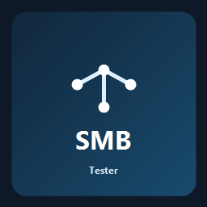
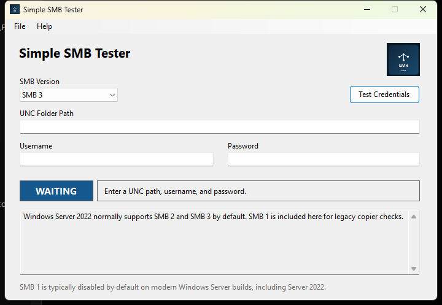

# Simple SMB Tester

  

Simple SMB Tester is a lightweight Windows desktop utility for checking whether a username and password can authenticate to an SMB share or folder path.

It is designed for quick troubleshooting when you need to confirm whether a target path works with **SMB 1**, **SMB 2**, or **SMB 3** — especially useful for older scanners, copiers, and other devices that may only support specific SMB versions.

## Screenshot

  

## Features

- Targets **.NET Framework 4.6**
- Tests **SMB 1**, **SMB 2**, and **SMB 3**
- Validates both authentication and the requested **share/folder path**
- Can optionally create a small **test text file** in the target folder to verify write access
- Shows a clear **success/failure** result in the UI
- Includes a portable **single EXE** build in [`artifacts/SimpleSmbTester.exe`](./artifacts/SimpleSmbTester.exe)

## Download the EXE

- **Portable EXE:** [`artifacts/SimpleSmbTester.exe`](./artifacts/SimpleSmbTester.exe)

## What the App Does

Simple SMB Tester lets you:

1. pick the SMB version you want to test
2. enter a UNC path such as `\\server\share\folder`
3. supply credentials
4. verify whether the login succeeds and whether the requested folder can actually be opened

That makes it useful for separating:

- bad credentials
- SMB version mismatch
- share-level access problems
- folder-level permission or path issues

## Usage

1. Launch [`artifacts/SimpleSmbTester.exe`](./artifacts/SimpleSmbTester.exe).
2. Choose the SMB version you want to test.
3. Enter a UNC path such as `\\server\share` or `\\server\share\folder`.
4. Enter the username and password.
5. Optional: enable **Create test text file in this folder** if you want to verify write access by creating `smb-test-probe.txt`.
6. Click **Test Credentials**.

## Write Access Probe

When the **Create test text file in this folder** option is enabled, the app creates `smb-test-probe.txt` in the target folder and writes a short text payload to it. This lets you confirm that the credentials can do more than open the folder path.

## Project Structure

- `src/` - WinForms source code and project file
- `tests/` - MSTest coverage for SMB service behavior
- `assets/` - logo, icon, and donation QR image
- `artifacts/` - ready-to-run EXE

## Third-Party Licensing

This project uses **SMBLibrary** and also includes modified SMBLibrary-derived source files for exact SMB2/SMB3 dialect testing:

- `ExactSmb2Client.cs`
- `ExactSmb2FileStore.cs`
- `SMB2Cryptography.cs`
- `SP800_1008.cs`

See:

- `SMBLibrary-LICENSE.txt`
- `THIRD-PARTY-NOTICES.txt`
